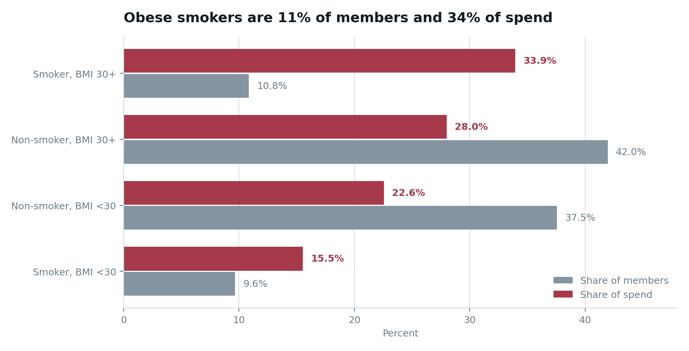
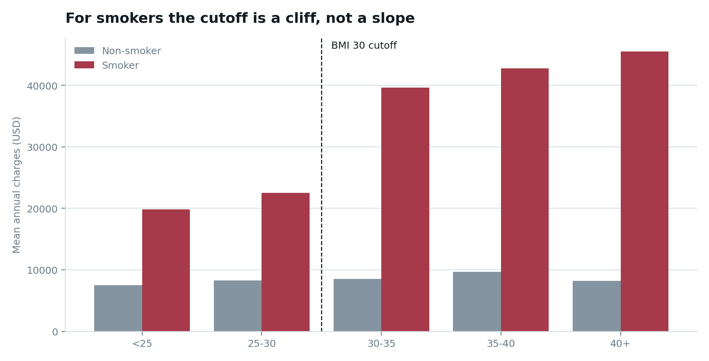
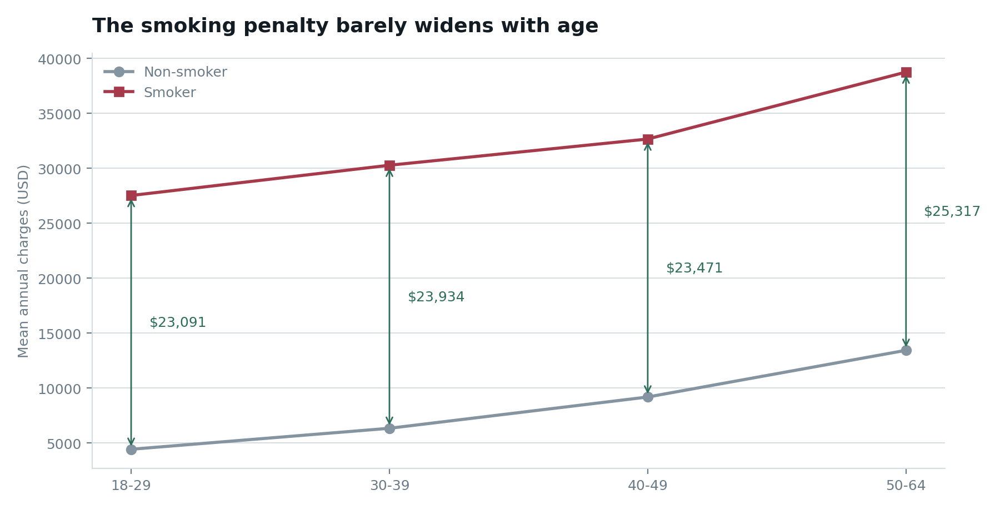

# Where to Spend the Health Intervention Budget

**A segmentation analysis of 1,337 medical cost records that identifies which member segment to target for health interventions, sizes what that targeting is worth, and shows which of its own findings should not be trusted.**

[](https://jcroffet.github.io/medical-cost-segmentation/)
[](https://pages.github.com/)



## The headline

Target 11% of members and you are addressing 34% of spend.

The 145 members who both smoke and have a BMI of 30 or above are the smallest actionable segment in the book and the most expensive one. Smoking and obesity do not add together — they multiply. Obesity costs a non-smoker **$879** a year; it costs a smoker **$20,195**. Neither risk factor on its own tells you where to intervene.

The counterintuitive consequence: the largest group in the book, the 561 obese non-smokers, is the *worst* target available. Moving every one of them below BMI 30 would be worth $493k in total, or $879 a head. That is where a general "tackle obesity" wellness budget would naturally go, and it returns roughly a tenth of what cessation aimed at obese smokers returns.

## Read this first

The source file is the widely circulated **Medical Cost Personal Datasets** teaching set, which is **simulated rather than drawn from real claims**. The findings below are real properties of the data and the methods are the ones that would be used on a live book, but no conclusion here describes an actual insurer or population.

One finding — a $20,195 discontinuity at exactly BMI 30 — is almost certainly an artifact of how the file was generated. It is reported and dissected rather than quietly dropped, because identifying it is the more useful analytical result. See [`data-quality-and-artifacts.pdf`](assets/reports/data-quality-and-artifacts.pdf).

## Questions explored

1. Which member segment consumes disproportionately more than its share of the book?
2. Do smoking and obesity combine additively, or does one amplify the other?
3. Is the apparent BMI 30 threshold a physiological effect or a data artifact?
4. Does the cost penalty for smoking widen with age, and should targeting skew old or young?
5. How much is each candidate intervention worth at realistic uptake rates?
6. How much of the variance in charges do the available variables fail to explain, and where does it sit?

## Dataset

| Dataset detail | Value |
| --- | --- |
| Records (raw) | 1,338 |
| Records analysed | 1,337 (one exact duplicate removed) |
| Columns | 7 — age, sex, bmi, children, smoker, region, charges |
| Missing values | 0 |
| Total spend | $17,754,185 |
| Median charge | $9,382 (mean $13,270, skew 1.52) |
| Smokers | 274 (20.5%) |
| BMI 30 or above | 706 (52.8%) |
| Time dimension | **None** — one row per member, no dates, no member ID |

Source file: [`data/insurance.csv`](data/insurance.csv). Every derived figure: [`data/summary.json`](data/summary.json).

## Analysis approach

The dataset has no time dimension, so the analysis is cross-sectional by necessity and everything is framed accordingly.

- **Segmentation** on two binary flags — declared smoking status, and BMI at or above the clinical obesity cutoff of 30 — producing four mutually exclusive segments.
- **Concentration analysis** on the charge distribution, since a skew of 1.52 makes any mean-only reporting misleading.
- **Interaction testing** — comparing the cost of one risk factor at each level of the other, rather than modelling them as independent.
- **Threshold testing** — fitting separate linear trends within each side of the BMI 30 boundary to distinguish a genuine dose-response gradient from a step function.
- **Intervention sizing** — moving each segment onto the observed mean of the segment it would belong to without the risk factor, then applying 5%, 10% and 20% uptake rates rather than reporting the ceiling alone.
- **Prioritisation** — scoring levers on impact × confidence ÷ effort, with confidence reflecting how well the underlying effect is established in this data.
- **Residual analysis** — identifying where a linear model on the available inputs fails, and what data would be needed to close the gap.

## Key findings

### 1. Smoking and obesity multiply rather than add

| | Non-obese (BMI <30) | Obese (BMI 30+) |
| --- | --- | --- |
| **Non-smoker** | $7,977 (n=502) | $8,856 (n=561) |
| **Smoker** | $21,363 (n=129) | $41,558 (n=145) |

A 23-fold difference in the cost of the same risk factor, depending on whether it appears alongside smoking. The 145 members carrying both spend $6.03M of the book's $17.75M.

### 2. The BMI 30 threshold is an artifact, and it should be said out loud



Within smokers below BMI 30, each additional point adds about $491. Above 30, about $545. The gradient barely changes — yet the step at the boundary itself is $20,195.

Real physiology does not produce a $20,000 cliff at exactly 30.0. A simulation rule does. Any eligibility criterion or saving estimate built on that cutoff inherits the artifact, which is why the weight-programme lever aimed at obese smokers is scored low-confidence despite showing the second-largest theoretical ceiling in the analysis.

### 3. Age is a false lead



| Age band | Non-smoker | Smoker | Gap |
| --- | --- | --- | --- |
| 18–29 | $4,427 | $27,518 | $23,091 |
| 30–39 | $6,337 | $30,271 | $23,934 |
| 40–49 | $9,183 | $32,655 | $23,471 |
| 50–64 | $13,431 | $38,748 | $25,317 |

Both lines rise with age; the distance between them barely moves. Because the annual gap does not widen, a successful cessation at 25 banks that difference for forty years and one at 60 banks it for five. Targeting should skew **young**, which is the opposite of the intuitive play.

### 4. The largest population is the worst target

Obese non-smokers are 42% of the book and the entire theoretical prize from moving all of them below BMI 30 is $493k — $879 a head. The obese-smoker segment is a quarter the size and worth 9.6 times as much.

### 5. Geography concentrates the problem

The southeast carries 15.9% obese smokers against 8.9% across the other three regions, and that segment alone accounts for 45.7% of all southeast spend. Not a separate lever — the delivery sequence for the levers already chosen.

### 6. A quarter of the variance is not in the file

A linear model on all six inputs reaches R² = 0.75. The residual is not noise: 80 members sit more than $10,000 above prediction, including 10 non-smokers billing over $30,000 with unremarkable profiles. Something not captured here — diagnosis, claims history, a catastrophic event — is driving them.

## Recommendation

Scored on impact × confidence ÷ effort. The ceiling assumes complete conversion and no residual risk; the 10% column is the figure to take into a business case.

| Rank | Lever | Members | Ceiling | At 10% uptake | Confidence | Effort |
| --- | --- | --- | --- | --- | --- | --- |
| 1 | Cessation — obese smokers | 145 | $4.74M (26.7%) | $474k | High | Medium |
| 2 | Cessation — non-obese smokers | 129 | $1.73M (9.7%) | $173k | High | Medium |
| 3 | Instrument the data | — | unlocks the missing 25% | — | High | Low |
| 4 | Weight programme — obese smokers | 145 | $2.93M (16.5%) | $293k | **Low** — rests on the artifact | High |
| 5 | Weight programme — obese non-smokers | 561 | $0.49M (2.8%) | $49k | Medium | High |

**These are association-based ceilings, not causal effects.** With no time dimension, nothing here can demonstrate that quitting *causes* a cost reduction.

## What I would ask next

Ten questions the dashboard sets out in full, each with a metric, a measurement window and the decision it would settle. Most of them cannot be answered from this file — which is the point. Knowing which question your data cannot answer is worth more than another chart of the question it can.

A sample:

> **Does cessation actually reduce claims, and by how much?**
> *Metric:* change in mean per-member paid claims, verified quitters versus a propensity-matched control.
> *Window:* 12-month pre-enrolment baseline, 24 months post.
> *Decision:* renew, expand or cut the cessation vendor at contract renewal.
> *Status:* needs dated claims and a control group. This is the question the $4.74M ceiling is standing in for.

## Dashboard features

- Interactive underwriting grid — click any cell for full segment detail
- Population-versus-spend comparison across all four segments
- BMI threshold chart isolating the artifact
- Age-band chart with the constant smoker gap annotated
- Ranked intervention table driven directly from `summary.json`
- Ten forward questions, each flagged as answerable or blocked on missing data
- Explicit limitations section
- Downloads for all three reports, the raw CSV, the derived JSON and the analysis code
- Responsive layout, keyboard-accessible controls, reduced-motion support

## Tools and skills demonstrated

- Exploratory data analysis and data quality profiling
- Interaction and threshold detection
- Distinguishing genuine effects from data-generation artifacts
- Segment sizing and intervention prioritisation under uncertainty
- Communicating limitations without burying the finding
- Python (pandas, NumPy, Matplotlib, ReportLab)
- HTML, CSS, JavaScript, Chart.js
- GitHub and GitHub Pages

## Repository structure

```
medical-cost-segmentation/
├── index.html
├── styles.css
├── script.js
├── README.md
├── .nojekyll
├── analysis/
│   ├── analysis.py          # produces summary.json and all figures
│   └── build_reports.py     # produces the three PDF reports
├── assets/
│   ├── images/
│   │   ├── segment-population-vs-spend.png
│   │   ├── bmi-threshold.png
│   │   └── age-gap.png
│   └── reports/
│       ├── executive-summary.pdf
│       ├── segmentation-and-sizing.pdf
│       └── data-quality-and-artifacts.pdf
└── data/
    ├── insurance.csv        # source data
    ├── summary.json         # every published figure
    └── summary.js           # the same, for the dashboard
```

## View the project

### Live site

Enable GitHub Pages on the `main` branch, root folder. The dashboard will be served at `https://<username>.github.io/<repo-name>/`.

### Local preview

Clone the repository and open `index.html` in a browser. All dashboard data is embedded through `data/summary.js`, so it works without a local server.

### Reproduce the analysis

```bash
pip install pandas numpy matplotlib reportlab pillow
python analysis/analysis.py        # rewrites summary.json and the figures
python analysis/build_reports.py   # rebuilds the three PDFs
```

Every number published in this project is produced by those two scripts from the CSV in this repository. Nothing is hand-entered.

## Supporting reports

- [Executive summary — where to spend the health intervention budget](assets/reports/executive-summary.pdf) (3 pages)
- [Segmentation and intervention sizing](assets/reports/segmentation-and-sizing.pdf) (6 pages)
- [Data quality and the BMI 30 artifact](assets/reports/data-quality-and-artifacts.pdf) (4 pages)

## Limitations

- **The data is simulated.** It is a teaching dataset, not a real book of business. No conclusion here describes an actual insurer or population.
- **No causality is established.** There is no time dimension, so nothing here can show that removing a risk factor causes a cost reduction. Every saving figure is an association-based ceiling.
- **The BMI 30 effect is almost certainly a generator artifact**, and any lever depending on it is scored low-confidence for that reason.
- **Smoking status is self-reported and binary** — no intensity, no former-smoker category. Tobacco use is systematically under-declared in insurance settings.
- **Ages 18 and 19 are over-sampled** — 69 and 68 records against a flat ~28 for every other age. Unweighted age trends inherit that bias.
- **Small cells are directional only.** Members with four or five children (n=25, n=18) are reported but support no recommendation.
- **Charges are in an unstated price year** and cannot be inflation-adjusted or benchmarked externally.

## Author

**Joshua Croffet**
Data Analytics Student

---

*This project is for educational and portfolio purposes. It is not medical, actuarial or financial advice.*
